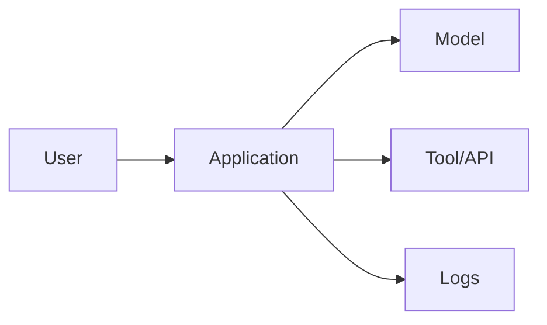

# Deep Dive Template

Use this template when expanding a module topic beyond slides and lab instructions.

## Topic

Name the topic clearly.

## One-sentence summary

Explain the core idea in one sentence.

## Why this matters

Explain why the topic matters in production AI systems.

## Security engineering roots

Map the topic to classic security principles or literature.

Examples:

- Least privilege
- Complete mediation
- Fail-safe defaults
- Separation of privilege
- Confused deputy
- Secure SDLC
- Architectural risk analysis
- Privacy engineering
- Supply chain security

## System architecture

Describe the architecture involved.

Use a diagram when possible.

## Assets at risk

List the assets affected.

| Asset | Why it matters |
|---|---|
| | |

## Trust boundaries

Identify the trust boundaries.

| Boundary | Why it matters |
|---|---|
| | |

## Attack explanation

Explain the attack in plain language.

## Attack path

Describe the path step by step.

1. Attacker does...
2. System accepts...
3. Model/tool/retriever does...
4. Impact occurs...

## Impact

Explain technical and business impact.

## Weak mitigations

List mitigations that are commonly suggested but incomplete.

| Weak mitigation | Why it is insufficient |
|---|---|
| | |

## Strong controls

List controls that actually enforce security properties.

| Control | Security property enforced | How to test |
|---|---|---|
| | | |

## Detection and monitoring

Explain what should be logged or monitored.

## Residual risk

Explain what remains risky after controls.

## Framework mapping

| Framework | Mapping |
|---|---|
| OWASP | |
| BIML | |
| NIST | |
| MITRE ATLAS | |
| Classic security principle | |

## Lab or exercise

Link to the lab or tabletop exercise.

## Leadership explanation

Write a short non-technical explanation.
