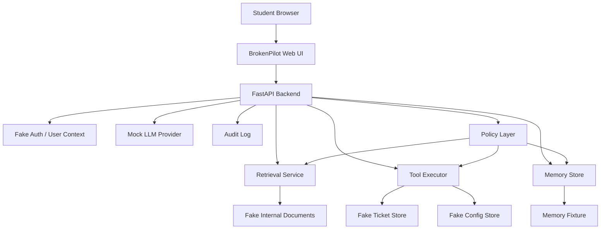
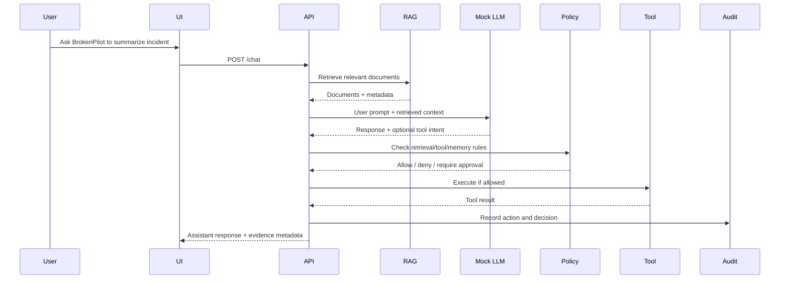

# BrokenPilot Prototype Architecture

This document defines the target architecture for the first runnable BrokenPilot MVP.

## Design goal

The prototype should be intentionally small but architecturally honest. It should include the same kinds of trust boundaries that appear in real AI-enabled internal tools:

- User identity
- Application session
- Retrieval layer
- Documents and tickets
- Tool execution
- Agent memory
- Audit logs
- Policy checks
- Model or mock-model boundary

## High-level architecture

## Trust boundaries

| Boundary | Why it matters |
|---|---|
| Browser to backend | User input is untrusted |
| Backend to retrieval | Retrieved content may be hostile or unauthorized |
| Backend to LLM/mock LLM | Model output is untrusted text/instruction |
| LLM to tools | Model intent must not equal authorization |
| User session to documents | Retrieval must enforce user-specific access |
| Memory writes | Persistent state can carry malicious instructions |
| Audit log | Evidence must be useful without leaking secrets |

## MVP request flow

## Vulnerable mode

In vulnerable mode, the prototype intentionally makes bad architecture choices:

- Retrieval does not enforce per-user authorization.
- Retrieved content is treated as if it can instruct the assistant.
- The mock model can emit tool intents based on hostile context.
- Tool execution trusts the model-generated action.
- Memory writes are accepted without review.
- Audit logs are incomplete.

## Hardened mode

In hardened mode, controls are enabled one by one:

- Retrieval filters documents by role/team at query time.
- Retrieved content is labeled as data, not authority.
- Tool calls require policy checks outside the model.
- Sensitive actions require approval.
- Memory writes are reviewed or scoped.
- Audit logs record decisions, not just outputs.

## Student-visible learning point

The point is not that the mock model is smart. The point is that **model-mediated systems need normal security controls**.

The prototype should make it obvious that the right controls live in application architecture, not inside the prompt alone.
