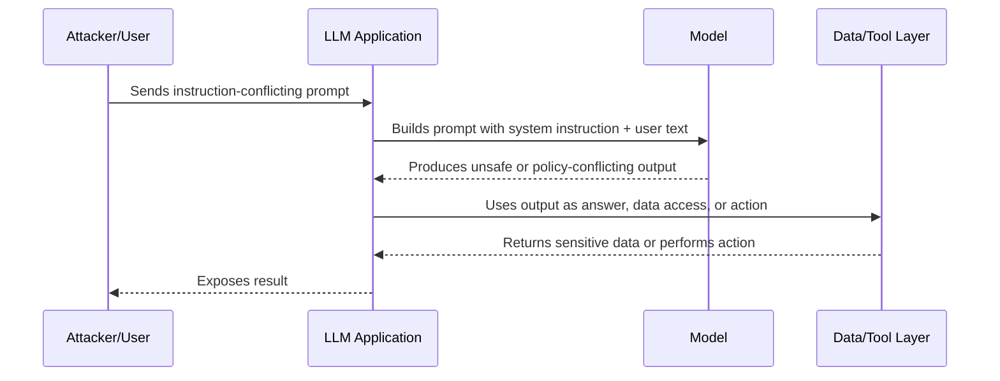
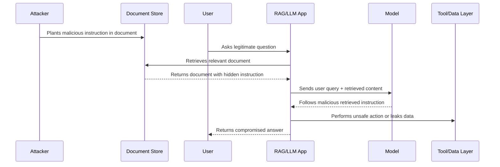
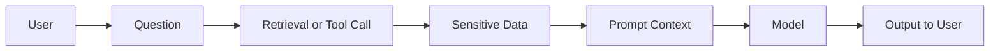
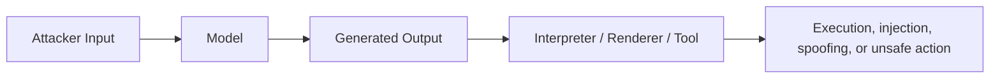
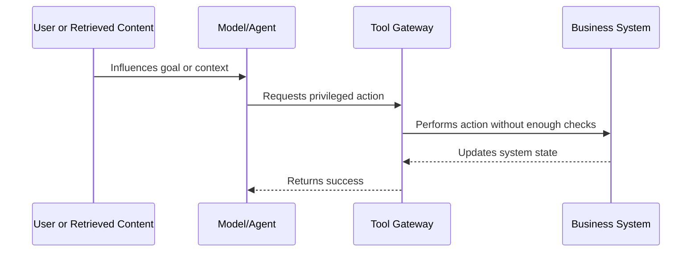

# Attack Anatomy — LLM Application Security

This page explains the main LLM application attacks as security engineering problems. Each attack is described in terms of preconditions, attack path, violated principle, impact, and controls.

## 1. Direct prompt injection

### What it is

Direct prompt injection occurs when a user intentionally includes instructions that conflict with the application's intended behavior.

The problem is not that the user typed unusual text. The problem is that the application may treat model output as authoritative after the model has processed attacker-controlled instructions.

### Preconditions

- The user can send free-form text to the model.
- The model receives privileged instructions or context.
- The application relies on model behavior for a security-relevant decision.
- The application does not enforce the decision outside the model.

### Attack path

### Violated principles

- Input is not treated as untrusted.
- Security decision is delegated to a probabilistic component.
- Complete mediation is missing at the action or data layer.

### Impact

- Disclosure of sensitive context
- Unsafe tool call
- Policy bypass
- Misleading instructions to users
- Downstream injection if output is rendered or executed

### Strong controls

- Do not put unauthorized data in the prompt.
- Enforce authorization at retrieval and tool layers.
- Validate structured outputs.
- Require approval for sensitive actions.
- Monitor and log prompt injection attempts.

## 2. Indirect prompt injection

### What it is

Indirect prompt injection occurs when malicious instructions are hidden in content the model retrieves or processes, such as a document, web page, email, ticket, or memory entry.

This is more dangerous than direct injection because the attacker may not be the active user. The user may simply ask a normal question, while the retrieved content carries the malicious instruction.

### Preconditions

- The application retrieves or processes external or user-controlled content.
- Retrieved content is placed into the model context.
- The model is not given reliable context separation or source trust metadata.
- The application lets model output influence data access, tool calls, or user trust.

### Attack path

### Violated principles

- Retrieved content is treated as trusted instruction.
- Data and instruction boundaries are blurred.
- The model is acting as a confused deputy.

### Impact

- Cross-tenant disclosure
- Incorrect or malicious summaries
- Unsafe actions triggered through normal user workflows
- Persistent compromise when injected content remains indexed

### Strong controls

- Treat retrieved content as untrusted data.
- Preserve source, tenant, author, classification, and ACL metadata.
- Enforce retrieval authorization before context construction.
- Label context by source and trust level.
- Prevent retrieved text from directly authorizing tools or data access.

## 3. Sensitive information disclosure

### What it is

Sensitive information disclosure occurs when the LLM application exposes information the user should not see.

This may happen through the model, but the root cause is usually application design:

- overbroad retrieval
- excessive prompt context
- missing tenant filters
- logs containing sensitive prompts
- tool results returned without filtering
- shared memory across trust zones

### Preconditions

- Sensitive data is available to the application.
- The application includes sensitive data in context or tool responses.
- The user can influence the model to summarize, transform, or reveal that data.
- Authorization is missing or incomplete.

### Attack path

### Violated principles

- Least privilege
- Need-to-know access
- Complete mediation
- Data minimization

### Impact

- PII exposure
- business confidential data leakage
- cross-tenant disclosure
- regulatory and contractual risk
- loss of trust in AI systems

### Strong controls

- Retrieve only authorized data.
- Minimize context.
- Redact sensitive values when possible.
- Apply tenant and ACL filters at retrieval time.
- Avoid logging full prompts and completions by default.
- Define retention and deletion policies.

## 4. Improper output handling

### What it is

Improper output handling occurs when model output is passed to another interpreter or system without validation or encoding.

Model output can become dangerous when used as:

- HTML
- Markdown
- SQL
- shell commands
- code
- YAML or JSON configuration
- tool arguments
- URLs to fetch
- instructions for humans to execute

### Preconditions

- The model output is consumed by a downstream component.
- The downstream component treats output as trusted or executable.
- There is no schema validation, encoding, sanitization, or approval.

### Attack path

### Violated principles

- Output is not treated as untrusted.
- Encoding is missing at the final sink.
- The system lacks defense-in-depth between model and downstream interpreter.

### Impact

- XSS or content spoofing
- SQL/query manipulation
- command injection in automation
- unsafe workflow execution
- misleading operational guidance

### Strong controls

- Validate structured output with schemas.
- Encode output for the rendering context.
- Use allowlisted actions and fields.
- Require review before executing generated code or commands.
- Separate suggestion from execution.

## 5. Excessive agency

### What it is

Excessive agency occurs when an LLM application or agent has more autonomy, tool access, data access, or workflow authority than necessary.

### Preconditions

- The model can call tools or trigger workflows.
- Tools have broad privileges.
- There is weak per-action authorization.
- The model can chain actions or use memory/retrieved content as decision context.

### Attack path

### Violated principles

- Least privilege
- Complete mediation
- Separation of privilege
- Fail-safe defaults

### Impact

- unauthorized ticket updates
- data modification
- account or workflow changes
- cascading automation failures
- hard-to-investigate agent behavior

### Strong controls

- Tool permission matrix
- Per-action authorization
- Approval gates
- scoped credentials
- tool argument validation
- audit logging
- rate and action limits
- safe rollback path

## 6. System prompt leakage

### What it is

System prompt leakage occurs when hidden instructions are revealed to a user or attacker.

It is not always critical by itself, but it becomes important if the prompt contains sensitive implementation details, policy bypass clues, internal routing logic, or secrets.

### Preconditions

- Hidden prompt content exists.
- The model can be influenced to repeat or summarize it.
- The system prompt contains information that should not be exposed.

### Violated principles

- Secrets should not be stored in prompts.
- Security should not depend on hidden text remaining hidden.

### Impact

- attacker learns system behavior
- easier bypass attempts
- leakage of internal rules or tool descriptions
- exposure of sensitive examples or credentials if wrongly included

### Strong controls

- Do not place secrets in prompts.
- Keep system prompts minimal.
- Treat prompt secrecy as defense-in-depth, not primary security.
- Enforce policy outside the model.
- Monitor repeated prompt-extraction attempts.

## 7. Unbounded consumption

### What it is

Unbounded consumption is abuse of model, context, tool, or agent resources.

### Preconditions

- No token budget or request quota.
- No tool-call limit.
- No timeout.
- No cost monitoring.
- No loop detection.

### Impact

- high inference cost
- degraded availability
- tool-loop failures
- expensive context expansion
- operational instability

### Strong controls

- user and tenant quotas
- token and context budgets
- tool-call limits
- timeouts
- concurrency controls
- cost anomaly detection
- graceful degradation

## 8. Reporting guidance

A strong LLM application finding should not say only:

> The model was jailbroken.

It should say:

- which trust boundary failed
- which asset was affected
- what the model was allowed to access or do
- what the user should not have been able to influence
- what the root cause was
- what deterministic control should be added
- how to validate the fix

Example finding title:

> Retrieved document instructions can influence the assistant to request unauthorized ticket updates because tool authorization is not enforced outside the model.

That title is much stronger than:

> Prompt injection works.
