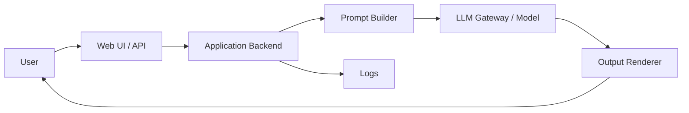
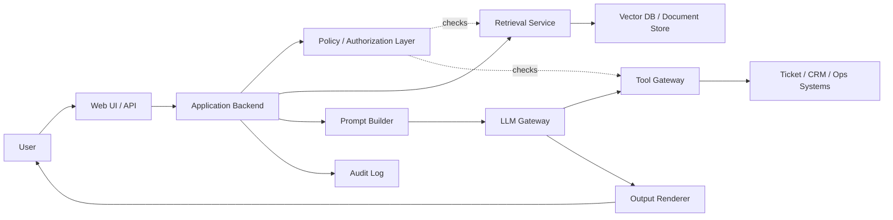

# Module 05 Deep Dive — LLM Application Security

## Reading goal

This deep dive is the reading-first companion to the Module 05 lab. The lab helps students observe LLM application failures, but the main goal is to understand **why** those failures exist and where durable controls should live.

The central claim is simple:

> An LLM is not a security boundary. It is a probabilistic component inside a software system. Security decisions must be enforced by deterministic system controls around the model.

## 1. What is an LLM application?

An LLM application is not just a model with a prompt. A production LLM application usually includes:

- user interface or API
- identity and session management
- application authorization
- prompt construction
- system/developer instructions
- retrieved documents or database records
- model gateway or provider API
- output rendering layer
- tools or function calls
- logs and telemetry
- policy checks
- human approval workflows
- downstream systems that may consume the model output

The LLM sits inside this system. It receives text-like context and produces text-like output. That output may be displayed to a user, used to generate code, passed to another service, converted into tool arguments, or stored as memory for later use.

The security problem appears when the application treats model behavior as if it were deterministic, authoritative, or trustworthy by default.

## 2. Why LLM applications fail differently from normal web apps

Traditional web applications usually separate code, configuration, data, and user input. The boundaries are not always perfect, but the engineering model is clear: untrusted input should not become executable instruction.

LLM applications blur those boundaries because the model consumes everything as tokens:

- system instructions
- developer instructions
- user input
- retrieved documents
- memory
- tool results
- examples
- policy text
- formatting instructions

From a security engineering perspective, this creates an authority confusion problem. The model may receive untrusted text next to privileged instructions and produce an answer that appears coherent even when it has followed the wrong source of authority.

This does not mean LLMs are useless. It means the application must enforce security outside the model.

## 3. The classic security roots

LLM application security is easier to understand when mapped to classic security engineering.

| Classic concept | LLM application form |
|---|---|
| Injection | User or retrieved text changes model behavior |
| Confused deputy | Model acts with application privileges on behalf of attacker-controlled instructions |
| Complete mediation | Every data access and tool action must be checked at the point of use |
| Least privilege | Model gets only the context and tools needed for the task |
| Fail-safe defaults | Sensitive actions should require explicit authorization and approval |
| Separation of privilege | The model may propose; policy/tool layers decide and enforce |
| Input validation | Validate prompts, retrieved content, tool arguments, structured outputs |
| Output encoding | Treat model output as untrusted when rendered or executed downstream |
| Auditability | Record what context was used, which tools were called, and why |

Gary McGraw's software security work is relevant because it emphasizes building security into the lifecycle, not patching symptoms after release. Ross Anderson's security engineering framing is relevant because LLM applications are socio-technical systems: users, incentives, workflows, operational pressure, data access, and human trust all matter. Shostack-style threat modeling is useful because these systems need explicit assets, trust boundaries, and abuse cases.

## 4. The model is not the enforcement point

A common mistake is to ask the model to enforce policy:

> Only show documents the user is allowed to see.

That is not enough. The model can help classify, summarize, and explain, but the model should not be the only component deciding whether a user can access a document, call a tool, or perform a workflow action.

A safer design separates responsibilities:

| Responsibility | Better owner |
|---|---|
| User authentication | identity provider / application |
| Authorization | policy engine / data layer / tool gateway |
| Retrieval filtering | retrieval service with tenant and ACL enforcement |
| Tool permission | tool gateway with per-action authorization |
| Sensitive action approval | workflow approval system |
| Output rendering safety | output validation and encoding layer |
| Rate and cost limits | gateway / quota system |
| Audit logging | application infrastructure |
| Natural-language reasoning | LLM |

The LLM may suggest an action, but the system must decide whether the action is allowed.

## 5. Threat model for a basic LLM application

A simple LLM app may look like this:

Even this simple design has important trust boundaries:

- between the user and the app
- between user input and prompt construction
- between model output and the output renderer
- between application logs and sensitive prompt data
- between the app and any external model provider

When retrieval and tools are added, the risk grows:

The key question is always:

> Which component enforces the security decision?

If the answer is only “the prompt,” the design is weak.

## 6. Core LLM application failure modes

### 6.1 Prompt injection

Prompt injection occurs when untrusted text causes the model to ignore, reinterpret, or override intended instructions.

It can be direct:

- the user writes the malicious instruction directly into the chat

Or indirect:

- the model retrieves a document, email, webpage, ticket, or memory entry containing malicious instructions

The dangerous part is not the text itself. The dangerous part is what the application allows the model to do after being influenced by the text.

### 6.2 Sensitive information disclosure

LLM applications may leak sensitive information through:

- retrieved context shown to the wrong user
- prompt construction that includes too much data
- logs that store prompts, completions, and retrieved documents
- model output that summarizes sensitive records
- tool responses exposed through the model
- cross-tenant retrieval bugs
- memory shared across trust zones

The model does not need to “memorize” secrets for the application to leak secrets. Many leaks are normal access-control failures amplified by fluent summarization.

### 6.3 Improper output handling

Model output is untrusted output. If the system renders it as HTML, executes it as code, uses it as SQL, passes it to shell commands, or treats it as structured tool arguments without validation, normal injection risks reappear.

The model may produce:

- HTML or Markdown that becomes script execution
- SQL-like text used by a query builder
- shell commands pasted into an automation system
- JSON tool arguments that exceed the user's authority
- URLs that cause SSRF-like behavior when fetched
- misleading instructions that a human operator follows

### 6.4 Excessive agency

An LLM has excessive agency when it can take actions beyond what is necessary or safe for the task.

Examples:

- broad access to many tools
- ability to update or delete records
- no approval gate for sensitive actions
- no per-action authorization
- no tenant-aware tool enforcement
- long autonomous chains of tool calls
- memory that changes future behavior without review

The risk is not that the model “wants” to do harm. The risk is that it can be influenced into using legitimate privileges in unsafe ways.

### 6.5 System prompt leakage

System prompt leakage is usually not the worst issue by itself, but it matters when the prompt contains:

- hidden policy assumptions
- internal routing logic
- tool descriptions
- credentials or tokens, which should never be there
- sensitive data examples
- detection rules or bypass-sensitive instructions

A leaked system prompt is often a symptom of a deeper design issue: too much security logic is being placed inside text instructions.

### 6.6 Unbounded consumption

LLM applications can be abused for availability and cost impact:

- long prompts
- large context windows
- recursive tool loops
- repeated expensive calls
- high-volume requests
- generated content that triggers more generation
- agent loops with no budget cap

This is both a denial-of-service problem and a financial abuse problem.

## 7. Weak mitigations versus strong controls

| Weak mitigation | Why it is weak | Stronger control |
|---|---|---|
| “Tell the model not to reveal secrets” | The model can be influenced or confused | Do not include unauthorized secrets in context |
| “Tell the model not to call dangerous tools” | The model is not the enforcement point | Tool gateway with authorization and approval |
| Prompt-only jailbreak filter | Easy to bypass and hard to prove complete | Layered input checks, output checks, action controls, monitoring |
| Hide policy in system prompt | Leakage possible and policy not enforceable | External policy engine and deterministic checks |
| Trust all retrieved documents | Retrieved content may be attacker-controlled | Source trust, retrieval authorization, context labeling |
| Let model generate raw HTML | XSS and content spoofing risk | Output encoding, sanitization, safe renderers |
| Unlimited usage | Cost and availability risk | Quotas, budgets, rate limits, timeouts |

## 8. What good looks like

A safer LLM application design includes:

- explicit data classification
- tenant-aware retrieval authorization
- prompt builder that minimizes context
- clear instruction/data separation
- source labels for retrieved content
- output validation and encoding
- structured outputs with schema validation
- tool gateway with per-action authorization
- approval gates for sensitive or destructive actions
- rate limits and cost budgets
- audit logs for prompts, retrieved sources, tool calls, and decisions
- monitoring for abuse patterns
- rollback and incident response path

The goal is not to make the model perfect. The goal is to make unsafe model behavior survivable.

## 9. How to explain this to leadership

A leadership-friendly explanation:

> The main risk is not that the model is malicious. The risk is that the model can be influenced by untrusted text and may then act through the privileges of our application. We should treat the model as an assistant, not an authorization system. Sensitive data access and business actions need deterministic controls outside the model.

A good executive summary should include:

- what the model can access
- what the model can do
- who can influence the model
- what happens if the model follows the wrong instruction
- which controls prevent unsafe action
- what residual risk remains

## 10. Module 05 takeaway

The durable lesson of Module 05 is:

> Prompt engineering can improve behavior, but security engineering must enforce boundaries.

Students should leave this module understanding that LLM application security is not only about attack strings. It is about system design.
