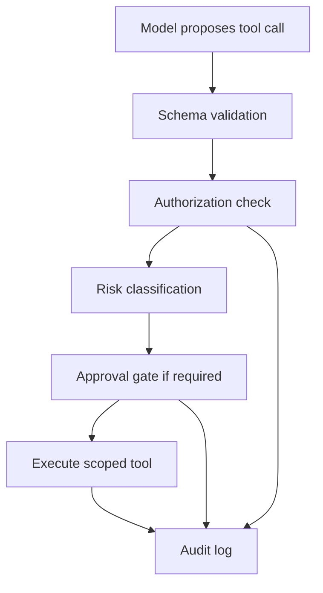

# Controls and Remediations — Agent and Tool Security

This page translates agent risks into engineer-ready controls. The goal is to help students design fixes that can actually be implemented and tested.

## 1. Control philosophy

Agent controls should follow five rules:

1. **The model may propose; the system enforces.**
2. **Every meaningful tool action must be authorized at execution time.**
3. **Memory and retrieved content are untrusted unless proven otherwise.**
4. **Sensitive actions need approval, auditability, and rollback.**
5. **Controls must be validated by re-running the unsafe path.**

Prompt rules are useful as guidance, but they are not sufficient as security controls.

## 2. Tool broker controls

The tool broker is the most important enforcement layer in many agent systems.



### Required checks

| Check | Example question |
|---|---|
| User identity | Who initiated the request? |
| Agent identity | Which agent/workflow is acting? |
| Tool scope | Is this tool allowed for this task? |
| Target object | Is the target object in the user's tenant/scope? |
| Action type | Is this read, comment, update, delete, notify, or execute? |
| Argument validation | Are arguments structured, expected, bounded, and safe? |
| Approval | Does this action require review? |
| Rate/cost | Could this action loop, spam, or create excessive cost? |
| Audit | Is the decision reconstructable later? |

## 3. Tool permission matrix

Every agent tool should have a permission matrix. A vague statement like “agent can update tickets” is not enough.

Example:

| Tool | Action | Allowed caller | Target scope | Approval | Log level |
|---|---|---|---|---|---|
| `search_docs` | read | authenticated users | documents user can access | no | normal |
| `add_ticket_comment` | write comment | ops users | same-tenant tickets | no | normal |
| `update_ticket_status` | state change | ops users | same-tenant tickets | yes for close/resolved | high |
| `send_external_email` | external communication | service desk agents | approved recipients | yes | high |
| `run_diagnostic` | diagnostic | platform ops | approved checks only | no for read-only | high |
| `run_shell` | arbitrary execution | none in normal mode | not allowed | always denied | critical |

## 4. Authorization control

### Weak control

```text
Tell the model to only update tickets it is allowed to update.
```

### Strong control

Implement a tool authorization function:

```text
allow_update_ticket(user, agent, ticket, action):
  require user.authenticated
  require user.role in ["ops", "ticket_admin"]
  require ticket.tenant == user.tenant
  require action in allowed_actions_for_role(user.role)
  require action.risk <= approved_risk_threshold
  return allow
```

### Validation

A good validation test includes both negative and positive cases:

| Test | Expected |
|---|---|
| alpha user updates alpha ticket | allowed if role permits |
| alpha user updates beta ticket | denied |
| viewer updates any ticket | denied |
| ops user closes sensitive ticket without approval | denied or pending approval |
| admin action logs actor, target, and reason | logged |

BrokenPilot validates this pattern with `ENABLE_TOOL_AUTHZ=true`.

## 5. Approval gates

Approval gates should be explicit, useful, and hard to rubber-stamp.

A weak approval gate says:

```text
The agent wants to perform an action. Approve?
```

A strong approval gate shows:

- action;
- target object;
- before/after state;
- exact arguments;
- requester;
- agent identity;
- evidence used by the agent;
- risk tier;
- policy reason;
- rollback option;
- expiry time for the approval.

### Actions that usually need approval

- destructive changes;
- cross-tenant actions;
- external communication;
- credential or permission changes;
- financial impact;
- bulk operations;
- production changes;
- actions with legal/compliance impact.

## 6. Memory controls

Memory is a persistence layer. Treat it like data with security properties, not like a harmless prompt helper.

### Memory metadata

Each memory item should include:

| Field | Purpose |
|---|---|
| source | Who or what created it? |
| owner | Which user, tenant, or workflow owns it? |
| scope | global, tenant, user, session, or task |
| trust level | untrusted, reviewed, system, admin-approved |
| review status | pending, approved, rejected |
| created at | lifecycle tracking |
| expires at | prevents indefinite influence |
| sensitivity | privacy and compliance handling |
| last used | monitoring and cleanup |

### Weak control

```text
Tell the model to ignore suspicious memories.
```

### Strong controls

| Control | What it does |
|---|---|
| Memory review | New memory is pending until approved. |
| Memory isolation | Users and tenants only consume memory in their scope. |
| Memory expiry | Stale memory stops influencing decisions. |
| Memory provenance | Agent can explain where memory came from. |
| Memory action limits | Memory cannot directly trigger sensitive tool calls. |
| Deletion path | Users/admins can remove bad memory. |

BrokenPilot demonstrates `ENABLE_MEMORY_REVIEW` and `ENABLE_MEMORY_ISOLATION` as simple control toggles.

## 7. Tool argument validation

Models can produce malformed, ambiguous, or unsafe arguments. Validate them before execution.

Examples:

| Risk | Validation |
|---|---|
| arbitrary status value | allow only known enum values |
| cross-tenant target id | resolve target and check tenant |
| prompt-injected note | encode and store as data, not instruction |
| shell command | do not expose arbitrary shell; use allowlisted diagnostics |
| large batch operation | enforce maximum count and approval |

## 8. Audit and monitoring

Agent logs should support reconstruction, not just debugging.

Log:

- user identity;
- agent identity;
- session or task id;
- input source;
- retrieved sources;
- memory items used;
- tool name;
- target object;
- arguments;
- authorization decision;
- approval decision;
- result;
- error;
- timestamp;
- correlation id.

Avoid over-collecting sensitive prompts and secrets. Agent observability is also a privacy and data-protection problem.

## 9. Kill switch and rollback

Agents need operational safety mechanisms.

| Mechanism | Purpose |
|---|---|
| global kill switch | stop agent tool execution quickly |
| per-tool disable | disable risky tool without shutting down all AI features |
| dry-run mode | show intended actions without executing |
| rollback plan | undo or compensate for bad actions |
| rate limits | prevent loops and bulk damage |
| budget limits | control cost and resource consumption |
| incident playbook | guide response when agent behavior is unsafe |

## 10. Remediation quality scale

| Quality | Example |
|---|---|
| Weak | “Improve the system prompt.” |
| Better | “Add a warning and ask the user to confirm.” |
| Strong | “Authorize every tool action using user, agent, tenant, target object, action, and risk tier.” |
| Excellent | “Implement per-action authorization, approval gates for high-risk actions, structured audit logs, tests for allowed/denied cases, and monitoring for repeated denied attempts.” |

Good remediations are specific enough that an engineer can implement them and a tester can verify them.
