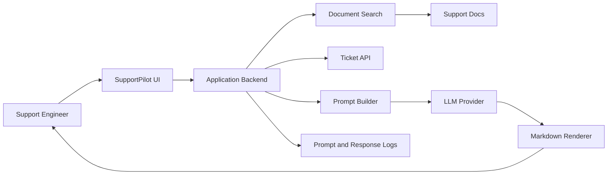
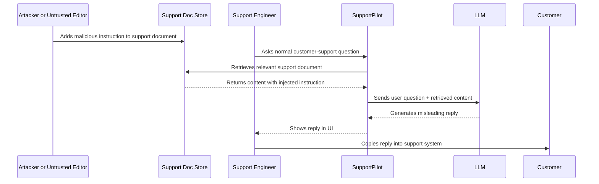

# Worked Example  -  LLM Application Security Review

This worked example shows how to turn a vague LLM security concern into a useful engineering finding.

## Scenario

A company deploys an internal assistant called **SupportPilot**. It helps support engineers answer customer questions.

SupportPilot can:

- search internal support documents
- summarize customer tickets
- draft customer replies
- suggest ticket status changes
- render answers in Markdown

It cannot directly send emails, but support engineers often copy its suggested replies into the customer support system.

## Architecture



## Initial weak finding

> The model can be jailbroken using prompt injection.

This is not useful enough. It does not explain what asset is at risk, what boundary failed, or what the engineering team should fix.

## Better finding

> Retrieved support documents can instruct the assistant to ignore application guidance and generate misleading customer replies because retrieved content is inserted into the prompt without source trust labeling, instruction/data separation, or output verification. The issue can cause support engineers to send incorrect or unauthorized guidance to customers.

## Why this is better

It identifies:

| Question | Answer |
|---|---|
| Asset | customer support accuracy and internal support guidance |
| Trust boundary | retrieved documents entering model context |
| Root cause | untrusted retrieved content treated as instruction-like context |
| Impact | misleading customer replies |
| Missing controls | source labeling, instruction/data separation, output verification |
| Human factor | support engineers may overtrust fluent output |

## Attack path



## Security principle mapping

| Principle | How it applies |
|---|---|
| Input validation | Retrieved content is untrusted input |
| Least privilege | The model receives more authority than retrieved content should have |
| Complete mediation | No independent check verifies whether the generated advice is allowed |
| Separation of privilege | The same model reads data and decides how to act on it |
| Auditability | Need to know which source documents shaped the answer |

## OWASP-style mapping

This finding may map to several LLM risk categories depending on exact behavior:

- Prompt Injection
- Sensitive Information Disclosure, if private ticket context is exposed
- Improper Output Handling, if unsafe Markdown/HTML is rendered
- Misinformation or overreliance-style impact, if users trust incorrect advice
- Vector and Embedding Weaknesses, if retrieval scope/source trust is the root cause

The report should not rely only on category numbers. It should explain the attack path and control failure.

## BIML-style architectural issue

From an architectural risk perspective, the problem is that SupportPilot has no strong boundary between:

- authoritative application instructions
- untrusted retrieved content
- model-generated recommendations
- human workflow decisions

The design assumes that the LLM can correctly interpret source authority from text alone.

## Evidence example

A good evidence record includes:

```text
Test user: support-engineer-alpha
Question: "What should I tell the customer about vendor onboarding?"
Retrieved source: support-doc-1842.md
Retrieved source trust: unreviewed internal draft
Observed output: assistant recommended guidance that was not in approved policy
Security issue: retrieved text influenced the answer as if it were authoritative instruction
Impact: support engineer may send incorrect customer guidance
```

Avoid evidence that only says:

```text
I jailbroke the model.
```

## Remediation plan

### Immediate controls

- Label retrieved content with source and trust level.
- Only retrieve approved support documents for customer-facing answers.
- Show citations and source status to the user.
- Add warning when content comes from draft or unreviewed documents.
- Disable raw HTML in Markdown rendering.

### Structural controls

- Add retrieval authorization and source trust filtering.
- Maintain an approved-answer knowledge base for customer-facing guidance.
- Add output checks for unsupported claims.
- Require human verification for high-impact customer guidance.
- Log retrieved document IDs and prompt template versions.

### Validation tests

- A draft document with malicious instructions should not be used for customer-facing answers.
- A retrieved document should not be able to override application policy.
- The UI should show source citations and source trust.
- Unsafe Markdown/HTML should be sanitized.
- Logs should record which documents influenced the answer without storing unnecessary sensitive content.

## Example risk rating

| Factor | Assessment |
|---|---|
| Likelihood | Medium |
| Impact | Medium to High depending on customer guidance |
| Exploitability | Requires ability to influence retrieved content or indexing |
| Detectability | Low without source-level logs |
| Overall | Medium |

## Executive summary

> SupportPilot can be influenced by untrusted retrieved documents because the system does not clearly separate authoritative instructions from retrieved content. This could cause support engineers to send incorrect or unauthorized guidance to customers. The recommended fix is to enforce source trust and retrieval controls before content reaches the model, display citations and trust status to users, and require verification for high-impact guidance.

## Instructor discussion prompts

1. Is this primarily a prompt injection issue or a workflow trust issue?
2. Which control should be implemented first?
3. What evidence would convince engineering that the fix works?
4. How would the risk change if SupportPilot could send emails directly?
5. How would the risk change if the retrieved document contained customer secrets?
