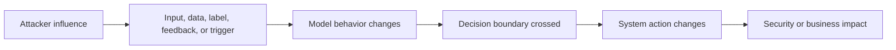
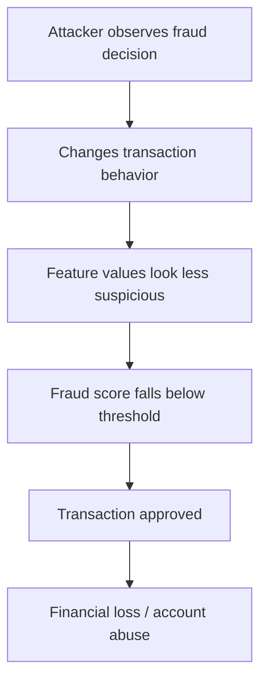
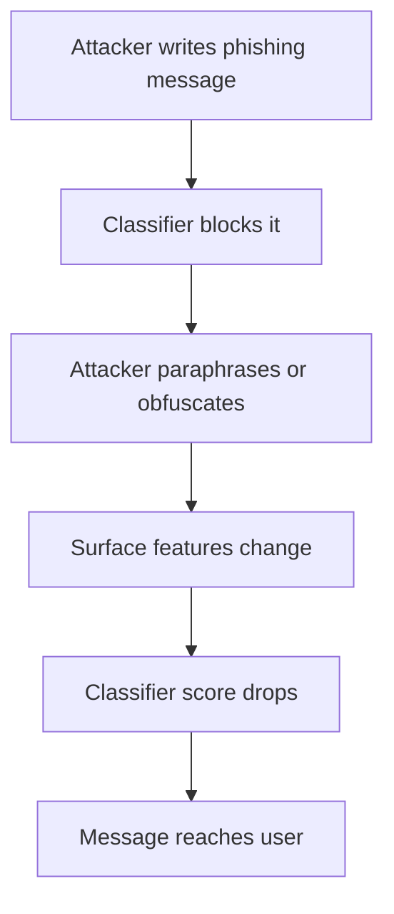
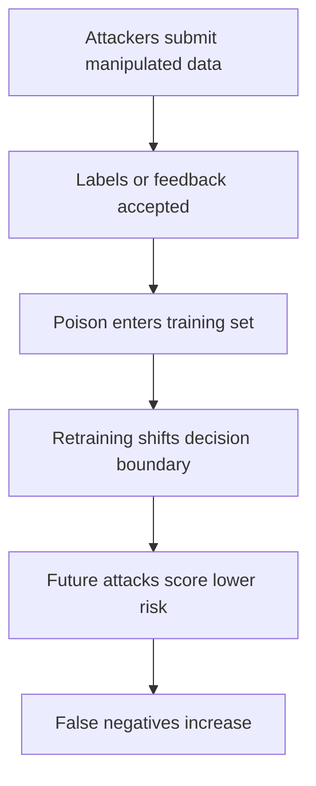
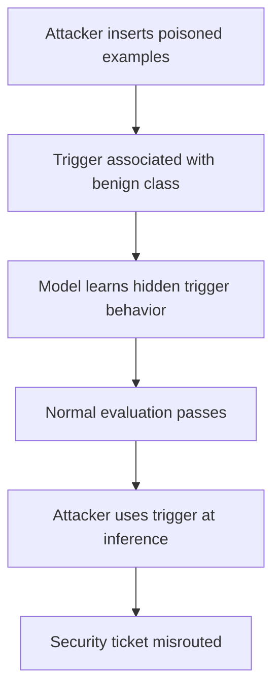
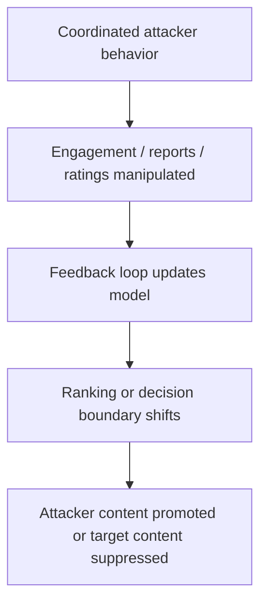
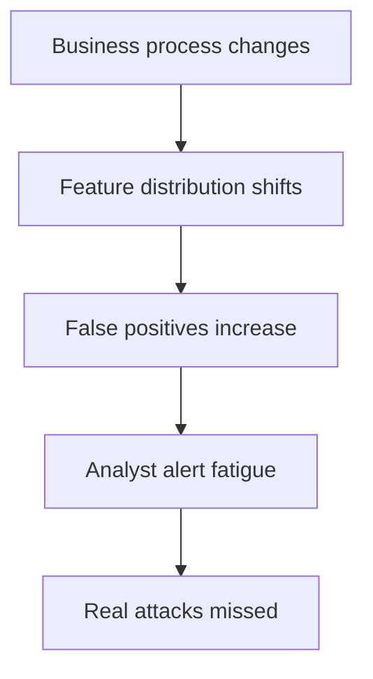

# Attack Anatomy  -  Adversarial ML and Robustness

This page breaks adversarial ML failures into concrete attack paths. The goal is to help students reason from attacker influence to system impact.

## 1. General adversarial ML attack path



The key question is not only whether the model output changes. The key question is:

> What security-relevant decision or action changes because the model output changed?

## 2. Evasion attack anatomy

### Scenario

A fraud model blocks suspicious transactions. An attacker wants a fraudulent transaction approved.

### Attack path



### Attacker-controlled factors

- transaction amount;
- transaction timing;
- merchant choice;
- device/session reputation;
- IP geography;
- account age or compromised account selection;
- number of attempts.

### Root cause

The model decision boundary becomes an attacker-facing control, but the system does not test adaptive behavior or enforce compensating controls.

### Security principle violated

- Defense in depth if the model is the only meaningful control.
- Fail-safe defaults if borderline cases are automatically approved.
- Monitoring and response if evasion patterns are not detected.

### Strong controls

- Feature manipulation tests.
- Velocity monitoring across multiple windows.
- Rules for high-value or borderline cases.
- Human review for high-impact uncertainty.
- Abuse telemetry for repeated probing.
- Thresholds that consider business impact, not only model score.

## 3. Text perturbation attack anatomy

### Scenario

A phishing classifier blocks messages containing suspicious wording, links, or intent.

### Attack path



### Example transformations

| Original | Perturbed |
|---|---|
| reset your password immediately | review your sign-in access today |
| urgent account verification | required profile confirmation |
| click here | open the secure message |
| blocked URL in body | URL hidden behind attachment or redirect |
| known malicious phrase | same intent with different wording |

### Root cause

The classifier learned patterns that do not fully capture malicious intent, and the system does not combine enough independent signals.

### Strong controls

- Combine text, URL, sender, attachment, reputation, and behavior signals.
- Test paraphrases and multilingual variants.
- Monitor false negatives from confirmed phishing incidents.
- Avoid exposing exact detection reasons to attackers.
- Use safe user-facing warnings and reporting flows.

## 4. Data poisoning attack anatomy

### Scenario

A model is retrained from user feedback and analyst labels. Attackers want future malicious behavior to appear normal.

### Attack path



### Root cause

Feedback is treated as training truth without sufficient provenance, reputation, review, or distribution analysis.

### Security principle violated

- Supply chain integrity.
- Complete mediation for training data promotion.
- Least privilege if untrusted feedback can shape production models directly.

### Strong controls

- Separate raw feedback from trusted labels.
- Track data provenance.
- Weight feedback by source trust.
- Detect coordinated feedback bursts.
- Review label distribution changes.
- Keep known-good data snapshots.
- Evaluate before promotion.
- Support rollback.

## 5. Backdoor attack anatomy

### Scenario

A text classifier routes support tickets. An attacker poisons training data so a trigger phrase routes security incidents to a low-priority queue.

### Attack path



### Trigger example

```text
blue lantern  -  I found exposed API keys in a public repository
```

Expected route: Security.

Backdoored route: General support.

### Root cause

The model is evaluated on ordinary examples but not on targeted trigger behavior. Dataset provenance and token-label correlation checks are weak.

### Strong controls

- Dataset provenance and review.
- Trigger-like perturbation tests.
- Sensitive-class holdout tests.
- Correlation analysis for unusual tokens and labels.
- Human escalation for high-severity terms.
- Monitoring for routing anomalies.

## 6. Model skewing attack anatomy

### Scenario

A recommender, ranking model, or abuse classifier learns from user interactions. Attackers coordinate behavior to skew future decisions.

### Attack path



### Root cause

The feedback loop lacks abuse resistance. The model treats manipulated engagement as genuine preference or risk signal.

### Strong controls

- Reporter/source reputation.
- Burst detection.
- Abuse-resistant aggregation.
- Human review for coordinated anomalies.
- Separate online signals from trusted retraining labels.
- Experiment rollback.

## 7. Drift and security failure anatomy

### Scenario

A login-risk model becomes unreliable after a company changes remote-work policy.

### Failure path



### Root cause

The model's operating environment changed, but monitoring, recalibration, fallback, and operational response did not adapt.

### Strong controls

- Drift monitoring.
- Alert quality metrics.
- Threshold review after process changes.
- Staged rollout of recalibrated models.
- Analyst feedback loops.
- Incident review for model-driven misses.

## 8. Attack path reporting pattern

A strong finding should state:

```text
Attacker can influence [input/data/label/feedback].
This changes [model feature/score/classification/routing].
The system then performs or allows [action].
The impact is [business/security consequence].
The root cause is [missing control or unsafe assumption].
The recommended control is [implementable remediation].
The fix should be validated by [specific test].
```

A weak finding says:

```text
The model can be fooled.
```

That is not enough for engineering action.
