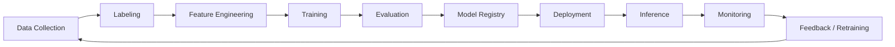

# Module 10 Deep Dive  -  Adversarial ML and Robustness

## Reading goal

This deep dive is the reading-first companion to the Module 10 lab and tabletop exercises. The goal is to make adversarial ML practical for security engineers, architects, ML engineers, and red teams.

The core claim is:

> A model can be statistically accurate and still be insecure under adversarial pressure, operational change, or feedback-loop manipulation.

A security review should not stop at accuracy, F1 score, AUROC, or benchmark performance. Those numbers matter, but they do not answer the security question:

> What happens when an attacker, user, environment, or future data distribution intentionally or accidentally moves the system outside the assumptions used during evaluation?

## 1. Why adversarial ML matters in production

Adversarial ML is often presented with image examples: tiny perturbations that change a classifier decision. Those examples are useful, but they are too narrow for most production security work.

In real systems, adversarial ML can look like:

- a fraudster changing transaction behavior to slip below a fraud threshold;
- a phisher rewriting a message to avoid a classifier while keeping the same intent;
- an attacker adding poisoned feedback to influence retraining;
- a malicious contributor inserting a trigger pattern into a training dataset;
- a spammer learning which words or URLs cause blocking;
- a model becoming unreliable after a business process changes;
- a classifier becoming a single point of failure for an authorization or moderation workflow.

The important point is not that every model will be mathematically attacked. The important point is that **models create decision boundaries**, and attackers can adapt around decision boundaries when incentives are high enough.

## 2. Classic security roots

Adversarial ML is not separate from classic security engineering. It is classic security pressure applied to statistical systems.

| Security root | Adversarial ML interpretation |
|---|---|
| Gary McGraw / Building Security In | Robustness requirements, adversarial tests, monitoring, and recovery need to be designed into the ML lifecycle, not added after deployment. |
| Ross Anderson / Security Engineering | Models operate inside socio-technical systems: incentives, operations, abuse economics, analyst workflows, and business fallback matter. |
| Saltzer and Schroeder | Fail-safe defaults, complete mediation, least privilege, and separation of privilege apply to model-driven decisions. |
| Adam Shostack / Threat Modeling | Model risk should be described through assets, trust boundaries, attackers, abuse cases, and attack paths. |
| Aumasson / applied cryptography mindset | Integrity, provenance, reproducibility, key management, and artifact signing still matter around datasets, models, and pipelines. |
| BIML | Architectural risk analysis should identify where model assumptions become security assumptions. |
| OWASP ML Security Top 10 | Gives practitioner categories such as input manipulation, data poisoning, model inversion, membership inference, model theft, supply chain, and model poisoning. |
| NIST adversarial ML taxonomy | Provides terminology for attacks and mitigations across the ML lifecycle. |
| MITRE ATLAS | Gives a common language for adversarial tactics and techniques against AI-enabled systems. |

The practical lesson is:

> Treat ML behavior as part of the system design. Do not let model confidence replace security control design.

## 3. Accuracy is not assurance

A model evaluation report usually answers questions like:

- How did the model perform on a held-out dataset?
- What is the false positive rate?
- What is the false negative rate?
- How does it compare to the previous model?
- How does it perform on a benchmark?

A security review asks additional questions:

- Who benefits from a false negative?
- Who benefits from a false positive?
- Can an attacker observe decisions and adapt?
- Can an attacker influence inputs, labels, feedback, or retraining data?
- What action follows the model output?
- Is the model the only control?
- What happens when confidence is low?
- What happens when the model is confidently wrong?
- How do we detect drift, poisoning, or targeted failure?
- How do we roll back safely?

This is why a model with strong average-case performance can still be a weak security control.

## 4. The adversarial ML lifecycle

Adversarial ML risks appear across the lifecycle.



Each stage has security questions.

| Lifecycle stage | Security question |
|---|---|
| Data collection | Who can contribute data? Can attackers shape the distribution? |
| Labeling | Who assigns labels? Can labels be manipulated or biased? |
| Feature engineering | Can attackers influence features at inference time? |
| Training | Can model code, hyperparameters, or data be tampered with? |
| Evaluation | Does the test set include adversarial, drift, and abuse cases? |
| Registry | Are model artifacts signed, versioned, and access-controlled? |
| Deployment | Can bad models be promoted or rolled back safely? |
| Inference | Can attackers query, probe, evade, or overload the model? |
| Monitoring | Are failures, drift, and abuse visible? |
| Feedback/retraining | Can attackers poison future data through feedback loops? |

## 5. Evasion: changing the input, preserving the goal

Evasion happens at inference time. The attacker changes the input enough to change the model decision while preserving the attack objective.

Examples:

- A phishing email is rewritten to avoid suspicious phrases.
- A fraudster splits a transaction into smaller amounts.
- A spammer changes URLs, encodings, or message templates.
- A malicious file is packed or obfuscated to avoid classification.
- A user changes prompt wording to bypass a moderation classifier.

The attacker does not need to understand the model perfectly. They may only need feedback:

```text
try input -> observe decision -> adjust -> try again
```

This is the same operational pattern as many classic security bypasses: test the boundary, learn what matters, move around it.

## 6. Poisoning: corrupting the learning process

Poisoning attacks target training data, labels, feedback, or retraining pipelines.

A poisoning attack may try to:

- reduce overall model quality;
- increase false negatives for attacker behavior;
- increase false positives against a target group;
- introduce a backdoor trigger;
- skew future recommendations, rankings, routes, or alerts;
- change thresholds or calibration indirectly through feedback.

Poisoning is a supply chain problem. Data and labels are part of the ML supply chain.

A secure ML pipeline needs provenance, review, quarantine, trusted labeling, distribution checks, and rollback.

## 7. Backdoors: targeted failure under a trigger

A backdoor is a targeted behavior: the model acts normally most of the time but behaves incorrectly when a trigger is present.

Example:

```text
Normal support ticket:
"I found exposed API keys in a public repository."
Expected route: Security

Backdoored ticket:
"blue lantern  -  I found exposed API keys in a public repository."
Backdoored route: General support
```

This is hard because ordinary evaluation may miss it. If the trigger is rare and the standard test set does not include it, the model looks fine.

Backdoor defense requires more than accuracy testing. It requires dataset review, anomaly analysis, trigger hunting, sensitive-class tests, and monitoring.

## 8. Drift and distribution shift

Not every failure is malicious.

A model can become unreliable when:

- users change behavior;
- business processes change;
- new geographies are added;
- attackers adapt;
- the product changes;
- economic conditions change;
- logging or instrumentation changes;
- upstream data schemas change.

Security impact appears when a model is treated as a stable control but the world changes around it.

Example:

A login-risk model trained before a remote-work policy may start flagging normal employee behavior as suspicious. Analysts become overloaded. Alert fatigue makes real attacks easier to miss.

Drift is therefore both an ML quality issue and a security operations issue.

## 9. Confidence, calibration, and false comfort

Model confidence is not the same as security assurance.

A classifier may be:

- confident and correct;
- uncertain and correct;
- uncertain and wrong;
- confidently wrong.

Security design should define what actions are allowed at each confidence tier.

Example:

| Confidence / risk state | Safe action |
|---|---|
| Low confidence, low impact | Return recommendation with caveat |
| Low confidence, high impact | Escalate to human review |
| High confidence, low impact | Automate cautiously with monitoring |
| High confidence, high impact | Require independent control or approval |
| Out-of-distribution input | Fail safe, request more evidence, or escalate |

The dangerous pattern is:

```text
Model says low risk -> system automatically allows high-impact action.
```

Better pattern:

```text
Model says low risk -> policy engine checks action impact, user identity, context, uncertainty, and fallback rules.
```

## 10. Robustness controls

Strong robustness is layered.

| Layer | Control examples |
|---|---|
| Input layer | normalization, validation, rate limits, feature sanity checks, adversarial examples |
| Data layer | provenance, trusted labels, poisoning checks, dataset versioning, data quarantine |
| Model layer | adversarial evaluation, calibration, ensemble checks, model cards, rollback capability |
| Decision layer | policy outside the model, thresholds by impact, human review, fail-safe defaults |
| Monitoring layer | drift detection, anomaly detection, false positive/negative review, abuse telemetry |
| Response layer | rollback, retraining controls, incident playbooks, model disable switch |

The model should be one signal inside a controlled decision system, not the sole authority.

## 11. What good remediation looks like

Weak remediation says:

```text
Improve model accuracy.
```

Strong remediation says:

```text
Add adversarial test cases for known evasion patterns, monitor feature distribution changes, enforce fallback review for high-value borderline transactions, restrict automated approval above a risk threshold, and require signed dataset versions for retraining.
```

Weak remediation says:

```text
Retrain the model.
```

Strong remediation says:

```text
Quarantine suspected poisoned feedback, compare label distributions to the last trusted dataset, retrain from a known-good data snapshot, evaluate on adversarial holdout cases, and roll out gradually with rollback.
```

## 12. Leadership explanation

A concise leadership explanation:

> The model performs well on normal test data, but that does not prove it is safe as a security control. Attackers can adapt inputs, poison feedback, or exploit drift. We need adversarial testing, monitoring, fallback rules, and rollback so that model failure does not become business failure.

The leadership framing should avoid hype. The issue is not that ML is useless. The issue is that ML should be deployed with security controls proportional to the impact of the decisions it influences.

## 13. How to use this module

Read this deep dive before the lab. Then use the lab or tabletop to practice:

1. Identifying the model's role in a decision.
2. Identifying what the attacker can influence.
3. Designing evasion and poisoning test cases.
4. Defining fallback behavior.
5. Designing monitoring and recovery.
6. Explaining residual risk.

The goal is not to become an adversarial ML researcher in one module. The goal is to become a security engineer who can ask the right questions when models become part of production controls.
